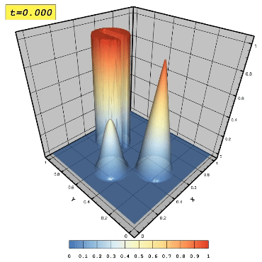

# Title
## Subtitle
### Another deeper title

$\frac{\partial{U}}{\partial t}+\nabla \cdot({\mathbf{v}U})=0$

$\mathbf{v}(x,y)=(0.5-y,x-0.5)$


In this particular test three bodies are considered namely a smooth centered at $(x_0=0.25,y_0=0.5)$, a sharp cone centered at $(x_0=0.5,y_0=0.25)$ and a slotted cylinder centered at $(x_0=0.5,y_0=0.75)$ described by the following functions respectively:


$\mathbf{f}(x,y)=\frac{1+cos(\pi r(x,y))}{4}$


$\mathbf{f}(x,y)=1- r(x,y)$


with $r_0=0.15$. The rest of the domain the solution is initialised with zero, and after one full revolution $t_{f}=2\pi$ the exact solution coincides with the initial solution. A triangular unstructured mesh is used as shown in  with $64$ edges per side of the computational domain. The WENO, CWENO and CWENOZ schemes ranging from 3rd- to 6th-order of spatial accuracy are employed, with their selected weights from the previous study. The obtained results following one revolution are illustrated in Fig. .


Bullet list:
* Start a line with an asterisk
* Food
  * Fruits
    * Oranges
    * Apples

Numbered list:
1. One
2. Two
3. Three

If you have inline code blocks, you can wrap them in backticks: `var example = true`.

If you've got a longer block of code, you can use ```:

```
if (isAwesome){
  return true
}
```



