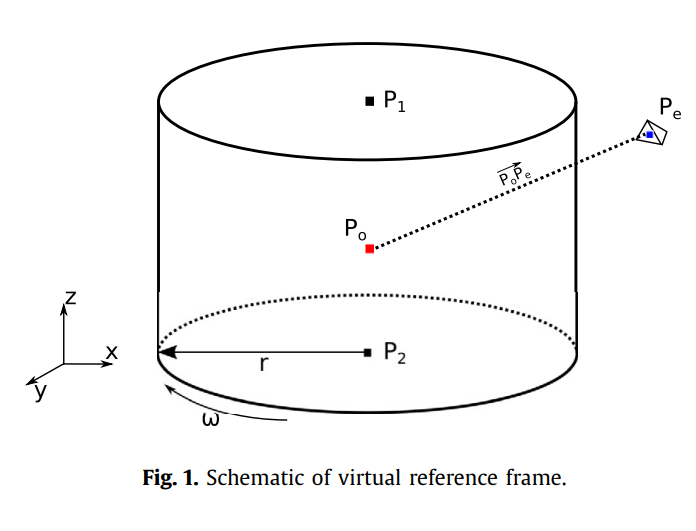

This document describes how to run a Multiple Reference Frame simulation on UCNS3D solver. The files for this tutorial are located in the Cranfield University repository Cord  (https://cord.cranfield.ac.uk/)


# Setup

The file ROTFRAME.dat contains the inputs used by the solver on the simulation. It includes the flag for the rotational reference frame, axis origin, rotational velocity, rotational peridiocity flag, periodic angle, reference velocity (tip blade velocity), number of rotors and points and radius  of the MRF domain.


Detailed Parameter Values Settings
===========================

ROTATIONAL REFERENCE FRAME MODE: customisable reference frame settings
-----------------------------------------------------
 ```
        POSSIBLE VALUES= 0 --> DEACTIVE
                         1 --> Single Rotating Frame
                         2 --> Multiple Rotating Frame
```
# Single Rotating Frame
SRF ORIGIN POINT: coordinates of the rotation center for SRF case
-----------------------------------------------------
 ```
        POSSIBLE VALUES=  xyz coordinate e.g.(0.0 0.0 0.0)
```
SRF VELOCITY: rotatinal velocity vector
-----------------------------------------------------
 ```
        POSSIBLE VALUES=  rotational u v w velocity:  e.g: Caradonna (0.0 0.0 265.9)
```
# Rotational Peridiocity
Periodic: Rotational peridiocity (check the rotational_periodic_readme.md for mesh instructions)
-----------------------------------------------------
 ```
        POSSIBLE VALUES= 0 --> Deactivated
                         1 --> Active
```
Angle: rotational peridiocity angle
-----------------------------------------------------
 ```
        POSSIBLE VALUES=  Any value   e.g: PSP 4blade(90.0)
```
Reference Velocity: Reference velocity for turbulence calculation (blade tip velocity (WxR))
-----------------------------------------------------
 ```
        POSSIBLE VALUES=  Any value
```
##  Periodic Mesh Setup

###  Mesh Requirements

For periodic simulations of the PSP rotor, the mesh needs to be set up with specific periodic interfaces to enable 90-degree rotational periodicity (for the 4-bladed rotor).

**Suggested Image 3a:** Diagram showing the periodic boundaries and their orientation for the PSP rotor.

###  Interface Setup in Pointwise

When creating the mesh in Pointwise similar to file [s-76_periodic.pw](https://dspace.lib.cranfield.ac.uk/items/a08659d3-5df7-4127-9eb8-5bf8229cc497):
1. Create two periodic interfaces:
   - "positive interface"
   - "negative interface"
2. Ensure the positive interface has a smaller angle relative to the negative interface
3. Label the interfaces appropriately for identification during export

###  Mesh File Modification

After exporting the mesh as a Fluent format (.msh), modify the interface definitions:

1. For the negative interface, locate the line:
```
(0 "Zone X YYYY faces AAAA..BBBB, BC: negative interface = 24")
(13 (X ZZZZZ ZZZZZ 18 0)(
```
Change to:
```
(0 "Zone X YYYY faces AAAA..BBBB, BC: negative interface = 24")
(13 (X ZZZZZ ZZZZZ 80 0)(
```

2. For the positive interface, locate the line:
```
(0 "Zone X YYYY faces AAAA..BBBB, BC: positive interface = 24")
(13 (X ZZZZZ ZZZZZ 18 0)(
```
Change to:
```
(0 "Zone X YYYY faces AAAA..BBBB, BC: positive interface = 24")
(13 (X ZZZZZ ZZZZZ 8 0)(
```

**Note:** The modification from `18` to
# Multiple Reference Frame

<p align="center">

</p>

Number of rotors: Total number of rotational subdomais
-----------------------------------------------------
 ```
        POSSIBLE VALUES=  Any integer value
```
For each rotor, we have the inputs point1, point2,radius and rotational velocity.  For two or more rotors, you must ensure that you provide the same inputs for each rotor in sequence.

Point1: coordinates of the center of the bottom cylinder face of the rotational domain
-----------------------------------------------------
 ```
        POSSIBLE VALUES=  xyz coordinate e.g.(0.0 0.0 0.0)
```
Point2: coordinates of the center of the Top cylinder face of the rotational domain
-----------------------------------------------------
 ```
        POSSIBLE VALUES=  xyz coordinate e.g.(0.0 0.0 0.0)
```
Radius: Radii of the rotor in metres
-----------------------------------------------------
 ```
        POSSIBLE VALUES=  any value
```
Rotational velocity: Rotational velocity (rad/s)
-----------------------------------------------------
 ```
        POSSIBLE VALUES=  any value
```
## Example: Caradonna SRF:

```
!ROTATIONAL REFERENCE FRAME MODE ( 0 DEACTIVE,1-SINGLE, 2-MULTIPLE)
1
!SRF ORIGIN POINT
0.0 0.0 0.0
!SRF VELOCITY
0.0 0.0 265.9
!Periodic: 1: ACTIVE  0: DEACTIVE |\| Angle: (deg) |\| Reference Velocity: (WxR)
0 					0.0			 303.9237
============= Multiple Reference Frame ==================
0
0.0 0.0 0.0      !Point 1 (MRF- Bottom cylinder face center)
0.0 0.0 0.0	   !Point 2 (MRF- Top cylinder face  center)
0.0 0.0          !MRF Radius - MRF Rotational velocity (rad/s)

```
## Example: Caradonna MRF:

```
!ROTATIONAL REFERENCE FRAME MODE ( 0 DEACTIVE,1-SINGLE, 2-MULTIPLE)
2
!SRF ORIGIN POINT
0.0 0.0 0.0
!SRF VELOCITY
0.0 0.0 0.0
!Periodic: 1: ACTIVE  0: DEACTIVE |\| Angle: (deg) |\| Reference Velocity: (WxR)
0 					0.0			 303.9237
============= Multiple Reference Frame ==================
1
0.0 0.0 -1.5      !Point 1 (MRF- Bottom cylinder face center)
0.0 0.0 1.5	   !Point 2 (MRF- Top cylinder face  center)
1.8 265.9          !MRF Radius - MRF Rotational velocity (rad/s)

```
## Example: MRF Caradonna multirotors:

```
!ROTATIONAL REFERENCE FRAME MODE ( 0 DEACTIVE,1-SINGLE, 2-MULTIPLE)
2
============SRF=================================
!SRF ORIGIN POINT
0.0 0.0 0.0
!SRF VELOCITY
0.0 0.0 0.0
!Periodic: 1: ACTIVE  0: DEACTIVE |\| Angle: (deg) |\| Reference Velocity: (WxR)
0 					180.0			 303.9237
============= Multiple Reference Frame ==================
2                  !Number of rotors
0.0 0.0 -0.5      !Point 1 (MRF- Bottom cylinder face center)
0.0 0.0 0.5	   !Point 2 (MRF- Top cylinder face  center)
2.0 265.9          !MRF Radius - MRF Rotational velocity (rad/s)
0.0 0.0 -2.5      !Point 1 (MRF- Bottom cylinder face center)
0.0 0.0 -1.5	   !Point 2 (MRF- Top cylinder face  center)
2.0 265.9          !MRF Radius - MRF Rotational velocity (rad/s)

```

## Example: MRF PSP Periodic:

```
!ROTATIONAL REFERENCE FRAME MODE ( 0 DEACTIVE,1 ACTIVE, 2-MRF)
2
!SRF ORIGIN POINT
0.0 0.0 0.0
!SRF VELOCITY
0.0 0.0 0.0
!Periodic: 1: ACTIVE  0: DEACTIVE |\| Angle: (deg) |\| Reference Velocity: (WxR)
1 					90.0			 218.072
============= Multiple Reference Frame ==================
1                  !Number of rotors
0.0 0.0 -0.5      !Point 1 (MRF- Bottom cylinder face center)
0.0 0.0 0.5	   !Point 2 (MRF- Top cylinder face  center)
2.0 120.427          !MRF Radius - MRF Rotational velocity (rad/s)

```

The test cases consists of four helicopter cases:


* Caradonna and Tung (out of ground effect): The mesh files and results of the test case from section 4 used on the publication ["Hovering rotor solutions by high-order methods on unstructured grids"](https://doi.org/10.1016/j.ast.2019.105648)  can be download [here](https://www.dropbox.com/scl/fi/x8d8u60p5z1kjde7mzsy9/CARADONA_8degrees_NS_MRF_Z_refined2.cas?rlkey=en29wpjda40q088royqy1k1aj&st=0ag63fat&dl=0).

* Paint Sensitive Pressure rotor (out of ground effect): The periodic mesh files and results of the test case from section 5 used on the publication ["Hovering rotor solutions by high-order methods on unstructured grids"](https://doi.org/10.1016/j.ast.2019.105648) can be download [here](https://www.dropbox.com/scl/fi/0ir2jfyyoxagm93rawqkf/psp_periodic.rar?rlkey=p4prk6w072qia77f24naukm9p&st=zdtlan7j&dl=0).

* `Black Hawk` UH-60a (out of ground effect): The periodic mesh files and results of the test case from section 6 used on the publication ["Hovering rotor solutions by high-order methods on unstructured grids"](https://doi.org/10.1016/j.ast.2019.105648)  can be download [here](https://www.dropbox.com/scl/fi/xv1qvkxi5vpkeixyz9u59/UH-60A_7m.cas?rlkey=p6h59htb6bqobkyi9mqiyynb9&st=k2y39iz9&dl=0).

* Caradonna and Tung (with and without ground effect): The mesh files and results of the test case used on the publication ["Simple multiple reference frame for high-order solution of hovering rotors with and without ground effect"](https://doi.org/10.1016/j.ast.2021.106518)  can be download at the [cranfield reposity cord](https://doi.org/10.17862/cranfield.rd.c.5284412.v1).

* S-76 (with and without ground effect): The mesh files and results of the test case used on the publication ["Simple multiple reference frame for high-order solution of hovering rotors with and without ground effect"](https://doi.org/10.1016/j.ast.2021.106518)   can be download at the [here](https://dspace.lib.cranfield.ac.uk/items/a08659d3-5df7-4127-9eb8-5bf8229cc497)

* Paint Sensitive Pressure full-helicopter (with and without ground effect): The periodic mesh files and results of the test case from section 5 used on the publication ["Numerical Investigation of full helicopter with and without the ground effect"](https://doi.org/10.1016/j.ast.2022.107401)and the  Data underlying this study can be accessed through the [Cranfield University repository](https://doi.org/10.17862/cranfield.rd.
19146182.v1). For this study we used the surface unstructured Blade grid downloaded at (https://www.aiaa-hpw.org/psp-rotor) and the robin fuselage geometry  downloaded at (https://github.com/Applied-Scientific-Research/robin-surface-mesh) whith changes accordingly to the mod7 geometry as exposed at (https://ntrs.nasa.gov/citations/20100033120).


## Running and post processing the Simulation

The detail for running the simulation are provided on instructions given at (https://github.com/ucns3d-team/UCNS3D)


