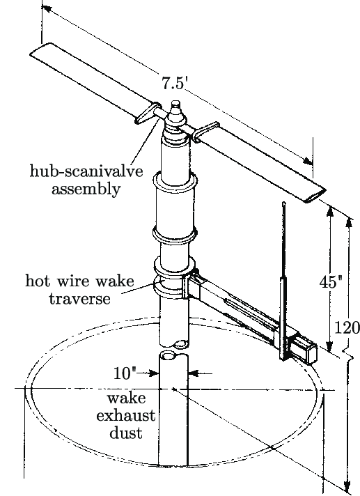
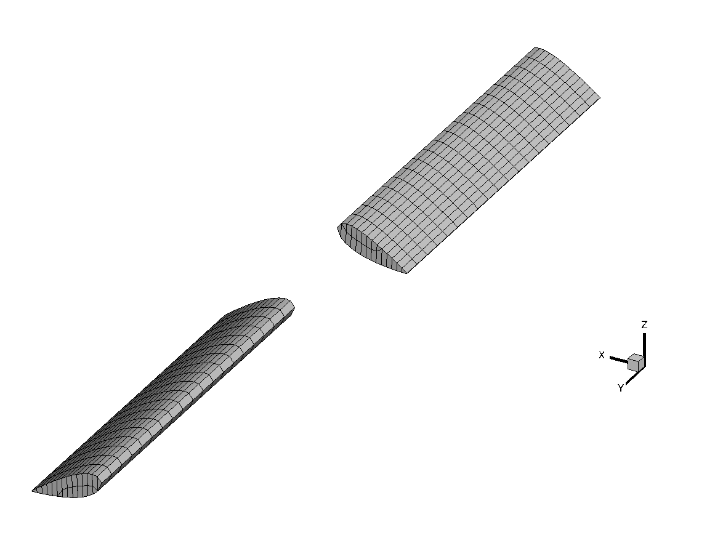
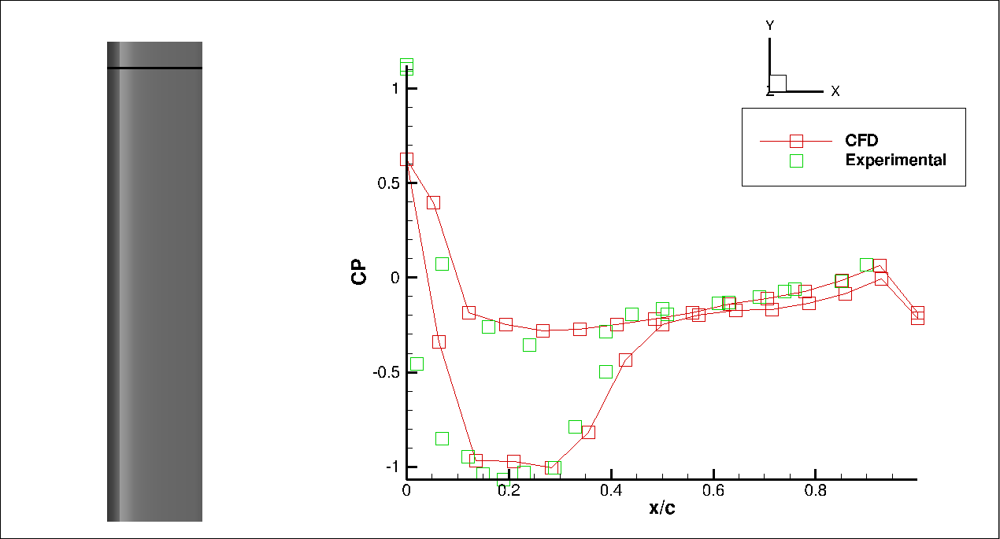
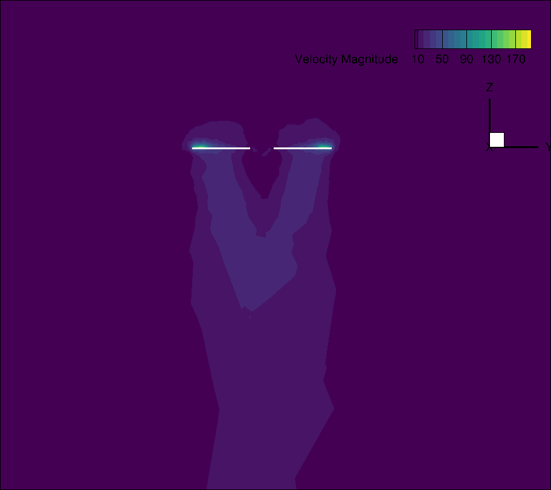

# UCNS3D Tutorial: Caradonna and Tung Rotor Simulation with Ground Effect

This tutorial will guide you through the process of setting up and running a Multiple Reference Frame (MRF) simulation for the Caradonna and Tung rotor using the UCNS3D solver.
## 1. Case Overview

The Caradonna and Tung rotor is a two-bladed rotor that serves as a benchmark case for helicopter rotor simulations.

Key characteristics:
- Two-bladed rotor
- NACA 0012 airfoil section
- Aspect ratio: 6
- Linear twist: 0 degrees
- Rotational speed: 1250 RPM (or 130.899 rad/s)
- Tip Mach number: 0.877

<p align="center">

</p>


## 2. File Setup

### 2.1 Mesh Files

Generate meshes for the case. Use the following specifications:

- Blade elements: 28 points (airfoil) × 20 points (span)
- Wake refinement: no refinement
- Boundary Layer: none
- Total elements: 54980

Place the following files in your working directory:
- `grid.msh`: Main grid file


<p align="center">

</p>

### 2.2 ROTFRAME.dat File

Create a file named `ROTFRAME.dat` in your working directory with the following content:

```
!ROTATIONAL REFERENCE FRAME MODE ( 0 DEACTIVE,1-SINGLE, 2-MULTIPLE)
2
!SRF ORIGIN POINT
0.0 0.0 0.0
!SRF VELOCITY
0.0 0.0 0.0
!Periodic: 1: ACTIVE  0: DEACTIVE |\| Angle: (deg) |\| Reference Velocity: (WxR)
0                   0.0          303.9237
============= Multiple Reference Frame ==================
1
0.0 0.0 -0.5      !Point 1 (MRF- Bottom cylinder face center)
0.0 0.0 0.5       !Point 2 (MRF- Top cylinder face center)
2.0 265.9        !MRF Radius - MRF Rotational velocity (rad/s)
```

This configuration sets up a Multiple Reference Frame simulation with one rotor.

### 2.3 UCNS3D Input File

Create your main UCNS3D input file (e.g., `input.dat`) with the following settings. Adjust the settings as needed for different simulation runs. For this coarse mesh we will deactivate the Turbulence as the mesh is coarse and with no Boundary layer.

```
====================================================================================================================================================================================================|
----------------------------------------------------------------------------------------UCNS3D PARAMETERS-------------------------------------------------------------------------------------------|
====================================================================================================================================================================================================|
|2:2D, 3:3D ||\|| I(STATISTICS 1=ENABLED, 0=DISABLED)  ||\||    CODE CONFIGURATION (0=DEFAULT)
3				 0   					0
|---------------------------------------------------------------------------------------------------------------------------------------------------------------------------------------------------|
EQUATIONS: |1: Navier-Stokes |2: Euler | 3: Linear-sinewave | 4: Linear-step  ||\||  Initial conditions profile (4 DEFAULT)
		1	   								4
|---------------------------------------------------------------------------------------------------------------------------------------------------------------------------------------------------|
TURBULENCE MODEL ACTIVATION:1:Active 0:Deactive   ||COUPLING TURBULENCE MODEL: |1:COUPLED | 0: DECOUPLED  ||SCALAR TRANSPORT COMPUTATION (number of passive scalars [only output for the first one])
0							0							0
```


## 3. Running the Simulation

1. Ensure all required files are in your working directory.
2. Run the UCNS3D solver using the command:
   ```
   mpirun -np <number_of_processes> ./ucns3d_p
   ```
3. Monitor the simulation progress through the output files (Force.dat, Moment.dat. and residual.dat)

## 4. Post-processing

After the simulation completes, use the UCNS3D post-processing tools or external software like ParaView for analysis.

### 4.1 Pressure Distribution

Use tecplot to extract pressure coefficients:

```
module load tecplot360ex
tec360 SURF.plt SURF_xxx.plt
```
1. click: plot > Slice.
2. Slice Location: Y-PLanes > 1.09m
3. Data > Extract Slices > extract
4. Data > Alter > specify Eq. insert the following:
```
{rot}=265.9
{section}={Y}
{CP}=({PRESSURE}-101325)/(0.5*1.2168*({rot}*{section})**2)
{Xmin}=-0.0471615
{Xmax}=0.141633
{dx}=((-{Xmax}+{Xmin})**2)**0.5
{x/c}=({X}-{Xmin})/({dx})
```
5. Frame > select area on the window frame > plot XY Line > Zone: slice: Y=1.09 > X-axis: x/c > Y-axis: CP
6. File > Load Data > select file: exp_8degrees_2540RPM_096rr.txt > Open > Text Spreasheet Loader > Append data to all shared frames
7. Mapping Style > Create Map > Map Name: Experimental > X-axis: x/c > Y-axis: CP > Zone: Zone 1
8. Activate Symbols


<p align="center">

</p>


### 4.2 Wake Visualization

In tecplot:
1. Load data `grid.plt` `OUT_XXX.plt`
2. Analyze > field Variables > Velocity  > U:U V:V W:W > OK
3. Analyze > calculate > Velocity Magnitude> calculate
4. plot > Slice> Contour> flood by : Velocity Magnitude


<p align="center">

</p>

## 5. Tips and Troubleshooting

- Start with 2nd order simulations and use the results to initialize higher-order runs.
- Monitor the thrust coefficient for convergence.
- If experiencing stability issues, try reducing the CFL number.

## 6. Further Analysis

- Compare your results with experimental data from Caradonna and Tung (1981).
- Analyze the differences between OGE and IGE simulations in terms of thrust production, wake structure, and tip vortex trajectory.
- Investigate the formation of the ground vortex in IGE cases.

By following this tutorial, you should be able to set up, run, and analyze comprehensive simulations of the Caradonna and Tung rotor in both out-of-ground and in-ground effect conditions using the UCNS3D solver with the Multiple Reference Frame approach.
