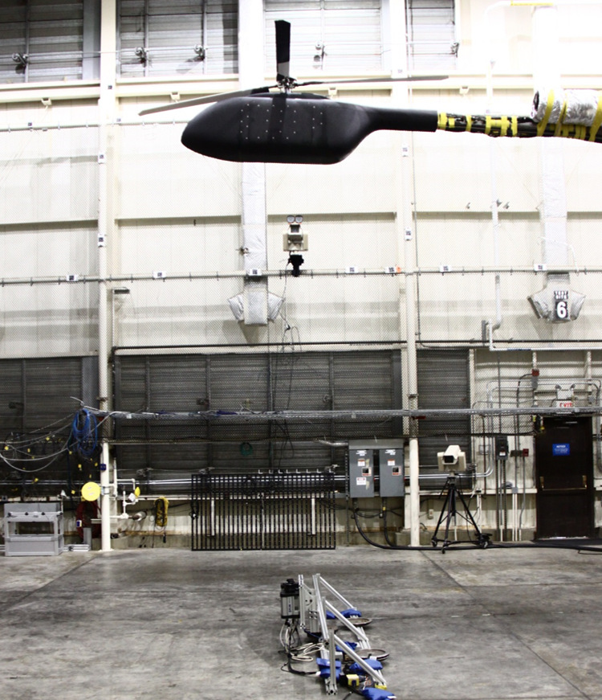
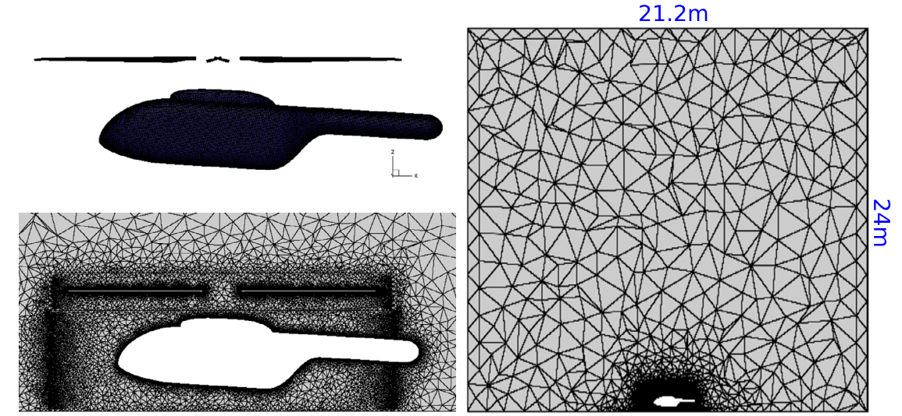
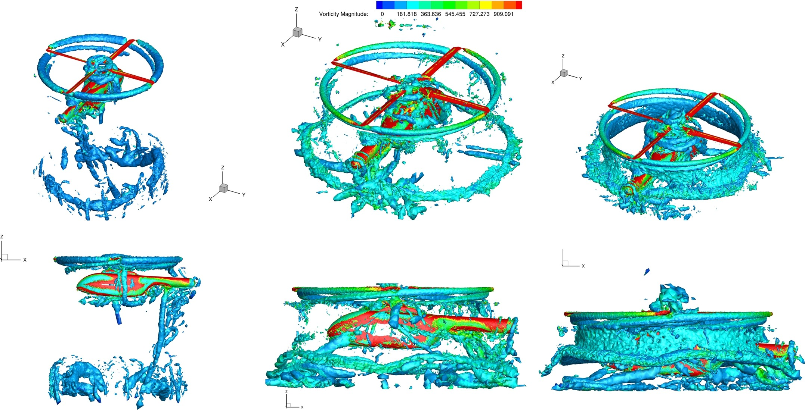

# UCNS3D Tutorial: PSP (Pressure Sensitive Paint) Rotor Simulation

This tutorial will guide you through the process of setting up and running a Multiple Reference Frame (MRF) simulation for the PSP rotor using the UCNS3D solver.

## 1. Case Overview

The Pressure Sensitive Paint (PSP) rotor is a model scale set of rotor blades designed jointly by the U.S. Army Aviation Development Directorate (ADD) and NASA, based on the High Lift Rotor (HLR) blades.

Key characteristics:
- Four-bladed rotor
- Linear twist: -14 degrees (starting at Blade Station 16.75)
- Main chord length: 5.45 inches
- 30-degree tip sweep
- Tip chord length: 3.27 inches
- Government RC-series airfoils
- Dynamic pressure sensors at r/R = 93% and r/R = 99%

<p align="center">

</p>
 This case is part of the [AIAA Rotorcraft Hover Prediction Workshop (HPW)](https://www.aiaa-hpw.org/)

## 2. File Setup

### 2.1 Mesh Files

You can download the mesh from [AIAA Rotorcraft Hover Prediction Workshop (HPW)](https://www.aiaa-hpw.org/file-share) and create your own compuational domain.

Alternatively you can download [full helicopter pointwise](https://dspace.lib.cranfield.ac.uk/handle/1826/22474 ) or the [periodic mesh.](https://www.dropbox.com/scl/fi/0ir2jfyyoxagm93rawqkf/psp_periodic.rar?rlkey=p4prk6w072qia77f24naukm9p&st=d0xjsq7x&dl=0)


Required files in working directory:
- `grid.msh`: Main grid file

<p align="center">

</p>


Alternatively you can create the blade geometry and mesh based on tje blade sections according to Table 1:

```
r/R     Twist(deg)  Chord(in)  Sweep(Deg)  Airfoil
0.12    8.2         5.45       0           -
0.17    8.2         5.45       0           RC(4)-12
0.25    7.01        5.45       0           RC(4)-12
0.65    1.4         5.45       0           RC(4)-12
0.70    0.7         5.45       0           RC(4)-10
0.80    -0.7        5.45       0           RC(4)-10
0.85    -1.4        5.45       0           RC(6)-8
0.95    -2.8        5.45       0           RC(6)-8
1.00    -3.5        3.27       30          RC(6)-8

```
### 2.2 ROTFRAME.dat File

Create a file named `ROTFRAME.dat` with the following content for periodic simulation:

```
!ROTATIONAL REFERENCE FRAME MODE ( 0 DEACTIVE,1 ACTIVE, 2-MRF)
2
!SRF ORIGIN POINT
0.0 0.0 0.0
!SRF VELOCITY
0.0 0.0 0.0
!Periodic: 1: ACTIVE  0: DEACTIVE |\| Angle: (deg) |\| Reference Velocity: (WxR)
1                   90.0            218.072
============= Multiple Reference Frame ==================
1                  !Number of rotors
0.0 0.0 -0.5      !Point 1 (MRF- Bottom cylinder face center)
0.0 0.0 0.5       !Point 2 (MRF- Top cylinder face center)
2.0 120.427       !MRF Radius - MRF Rotational velocity (rad/s)
```

### 2.4 UCNS3D Input File

Create your main UCNS3D input file  with the following settings. Adjust the settings as needed for different simulation runs.
```
====================================================================================================================================================================================================|
----------------------------------------------------------------------------------------UCNS3D PARAMETERS-------------------------------------------------------------------------------------------|
====================================================================================================================================================================================================|
|2:2D, 3:3D ||\|| I(STATISTICS 1=ENABLED, 0=DISABLED)  ||\||    CODE CONFIGURATION (0=DEFAULT)
3				 0   					0
|---------------------------------------------------------------------------------------------------------------------------------------------------------------------------------------------------|
EQUATIONS: |1: Navier-Stokes |2: Euler | 3: Linear-sinewave | 4: Linear-step  ||\||  Initial conditions profile (4 DEFAULT)
		1	   								4
|---------------------------------------------------------------------------------------------------------------------------------------------------------------------------------------------------|
TURBULENCE MODEL ACTIVATION:1:Active 0:Deactive   ||COUPLING TURBULENCE MODEL: |1:COUPLED | 0: DECOUPLED  ||SCALAR TRANSPORT COMPUTATION (number of passive scalars [only output for the first one])
0							0							0
|---------------------------------------------------------------------------------------------------------------------------------------------------------------------------------------------------|
====================================================================================================================================================================================================|
---------------------------------------------------------------------------------------------CONDITIONS-----------------------------------------------------------------------------------------------|
====================================================================================================================================================================================================|
FREE-STREAM CONDITIONS
Density ||\|| U-velocity||\||V-velocity ||\||W-velocity ||\||Pressure(if -1 then pressure=rho/gamma)
 1.2168		0.0		0.0		0.0		101325
|---------------------------------------------------------------------------------------------------------------------------------------------------------------------------------------------------|
Angle of Attack ||\|| WRT AXIS (XY-PLANE=(1 1 0),XZ-PLANE=(1 0 1))
0.0			1.0     1.0       1.0
|---------------------------------------------------------------------------------------------------------------------------------------------------------------------------------------------------|
Gamma ||\||Prandtl Number ||\|| Reynolds Number ||\||Characteristic Length
1.4	    0.72		 6000000			0.1905
|---------------------------------------------------------------------------------------------------------------------------------------------------------------------------------------------------|
====================================================================================================================================================================================================|
-------------------------------------------------------------------------------------------DISCRETISATION-------------------------------------------------------------------------------------------|
====================================================================================================================================================================================================|
SCHEME:1:LINEAR 2:MUSCL-TVD 3:WENO||\||FLUX HLLC:1,RUSANOV:2,ROE:3||\|| SPATIAL ORDER: 1-7  ||\|| LIMITER TYPE: 1=MIN,2=BJ,3=MOGE,4=SB,5=VA,6=VL,7=VENKATA.. ||\||POLYNOMIAL: 1: Generic  2: Legendre
2						1			    2					3								2
|---------------------------------------------------------------------------------------------------------------------------------------------------------------------------------------------------|
WENO RECONSTRUCTION: 1: CONSERVED 2: CHARACTERISTIC ||\|| STENCILS  ||\|| WEIGHT NORMALISATION ||\|| WENO CENTRAL WEIGHT (lamda)
2								0				0					100000.0
|---------------------------------------------------------------------------------------------------------------------------------------------------------------------------------------------------|
TEMPORAL ORDER: |(1-4):RK1-RK4, 5: RK-LTS, 10: IMPLICIT BACKWARD EULER |11: IMPLICIT 2ND-ORDER ||\|| CFL ||\||DTS TIMESTEP SIZE ||\|| ITERATION (FOR DTS ONLY) ||\|| Residual THRESHOLD
10												     15		0.00001			30				0.000001
|---------------------------------------------------------------------------------------------------------------------------------------------------------------------------------------------------|
BOUNDARY CONDITIONS: 0: Non-Periodic 1: Periodic ||\||  BOUNDARY CONDITIONS: 0: SUPERSONIC 1: SUBSONIC  ||\||  SCALING FACTOR:
1							1							1.0
|---------------------------------------------------------------------------------------------------------------------------------------------------------------------------------------------------|
Gradients Approximation(All Least squares=0, Green Gauss=1)||\|| LOW MACH TREATMENT (1 ACTIVATE, 0 DISABLE),
			1						0
|---------------------------------------------------------------------------------------------------------------------------------------------------------------------------------------------------|
====================================================================================================================================================================================================|
-------------------------------------------------------------------------------------------I/O OPERATIONS-------------------------------------------------------------------------------------------|
====================================================================================================================================================================================================|
TOTAL SIMULATION TIME SECONDS  ||\|| TOTAL NUMBER OF ITERATIONS ||\|| WALL CLOCK MAXIMUM TIME - REAL SECONDS:
1.0					900000				600
|---------------------------------------------------------------------------------------------------------------------------------------------------------------------------------------------------|
TECPLOT:1(BIN),0(ASCII),PARAVIEW BIN:2 ||\|| WRITE OUTPUT RATE (SEC) ||\|| WRITE RESTART RATE(SEC) ||\|| WRITE AVERAGE OUTPUT RATE(SEC) ||\||PRINT THE STENCILS AT THE PROBE POSITION(0 NO, 1 YES)
1				    	13200			200000				50000					0
|---------------------------------------------------------------------------------------------------------------------------------------------------------------------------------------------------|
AVERAGING (0-Disabled, 1-Enabled, computing mean and RMS) Only possible for Unsteady computations ||
0
|---------------------------------------------------------------------------------------------------------------------------------------------------------------------------------------------------|
COMPUTE FORCES: 1: ACTIVE  0: DEACTIVE ||\|| FREQUENCY:HOW OFTEN IN ITERATIONS ||\|| Write shear stresses 1: enable 0: disable
1	  					10					0
|---------------------------------------------------------------------------------------------------------------------------------------------------------------------------------------------------|
SIMULATION AVAILABLE: TURBULENT (PREVIOUS YES=1,0=NO)||\|| TYPE (UNSTEADY YES=1,0=STEADY)||\|| PASSIVE (PREVIOUS YES=1,0=NO) ||\|| PREVIOUS TURBULENCE MODEL (SA=1, K-OMEGA=2)
1								0				0					1
====================================================================================================================================================================================================|
====================================================================================================================================================================================================|
PROBES-----------------------------------------------------------------------------------------------|
====================================================================================================================================================================================================|
!NUMBER OF PROBES!
0				||NUMBER OF PROBE POSITIONS. They probe density, velocities and PS
!COORDINATES
0.50001    0.50001  	0.0		||PROBE POSITION #1


```
## 3. Running the Simulation

1. Ensure all required files are in your working directory.
2. Run the UCNS3D solver using the command:
   ```
   mpirun -np <number_of_processes> ./ucns3d_p
   ```
3. Monitor the simulation progress through the output files (Force.dat, Moment.dat. and residual.dat)

## 4. Post-processing

The post-processing data for the full helicopter out ground effect can be downloaded at [https://dspace.lib.cranfield.ac.uk/handle/1826/22472](https://dspace.lib.cranfield.ac.uk/handle/1826/22472)

<p align="center">

</p>

### 4.1 Pressure Distribution Analysis

Focus on pressure measurements at key stations:
- r/R = 93% (pressure sensor location))

<p align="center">

</p>
#- r/R = 99% (pressure sensor location)
- r/R = 93% (pressure sensor location))

<p align="center">

</p>


### 4.2 Performance Parameters
Calculate and compare:
- Thrust coefficient
- Torque coefficient
- Figure of Merit
- Blade loading distribution

<p align="center">

</p>

## 5. Validation Data

Compare results with experimental data from:
1. NASA 14x22 Rotor Test Cell data
2. PSP validation test data
3. Available pressure sensor measurements at r/R = 93% and 99%


## 6. References

1. PSP Rotor Workshop documentation
2. Original NASA/ADD design documentation
3. Experimental validation datasets

By following this tutorial, you should be able to set up and run a simulation of the PSP rotor using UCNS3D with the Multiple Reference Frame approach and periodic boundary conditions.
